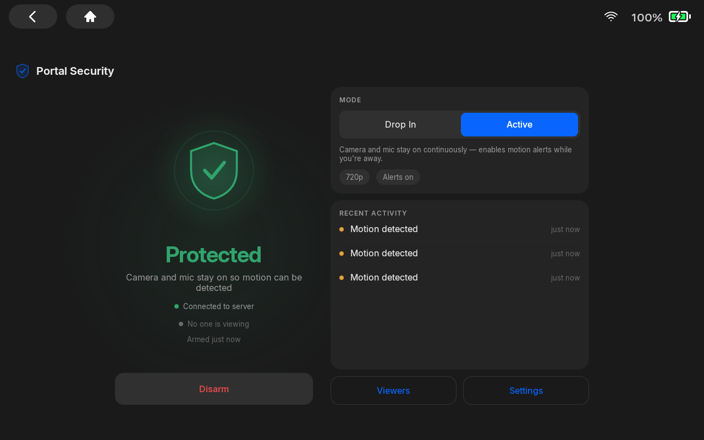
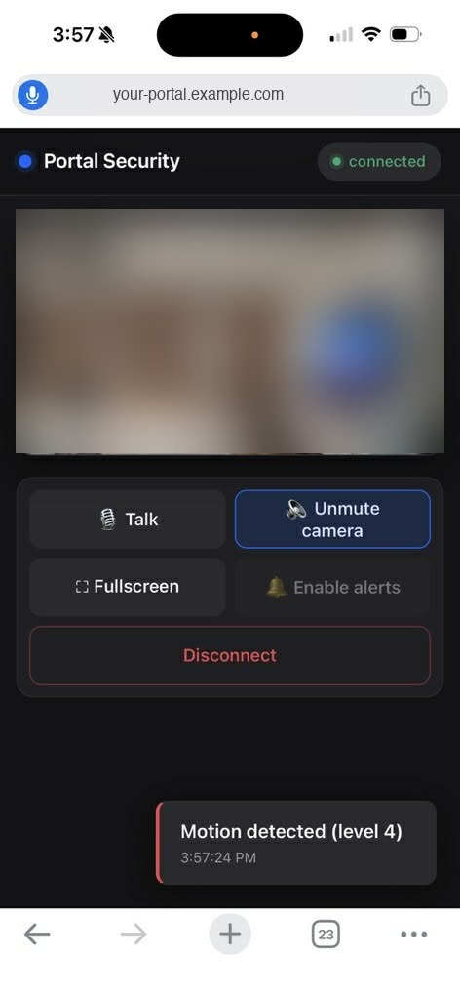
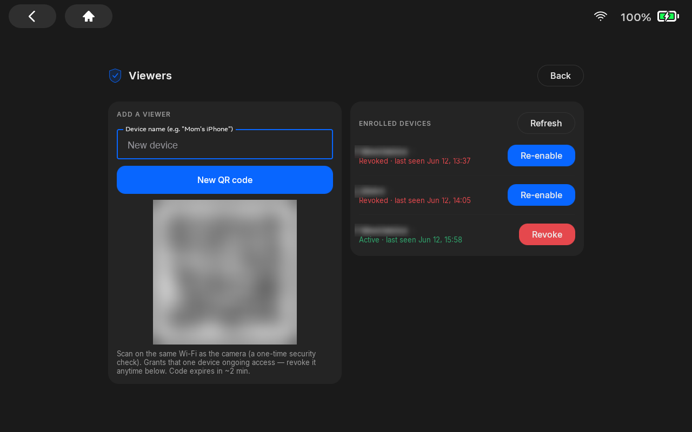
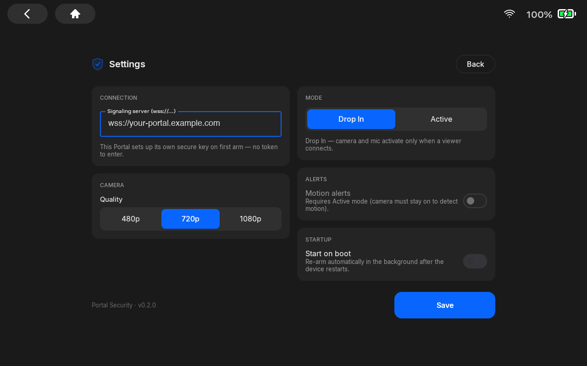

# Portal Home Security Camera

Turn an always-on **Meta Portal** device into a remotely-viewable home security
camera. The Portal captures its camera + microphone and streams them to your web
browser over **WebRTC (peer-to-peer)**. The video never flows through a
third-party server (only the tiny signaling/relay service is shared infra).

Features:

- **Live view + two-way audio** from any browser.
- **Motion alerts** — live in the tab and via **Web Push** (reaches you with no
  tab open; VAPID, no Google/Firebase).
- **Two capture modes** — *Drop In* (camera wakes only when a viewer connects)
  and *Active* (streams continuously, enabling motion detection while you're away).
- **Per-viewer access** — owner-managed, revocable, no shared password (see below).
- A professional on-device dashboard (no live feed shown on the Portal itself),
  with a device-PIN gate.

```
   ┌────────────────┐     SDP / ICE / motion      ┌────────────────────┐
   │  Portal app    │◄──────── WebSocket ─────────►│  signaling-server  │
   │ (Android,      │                              │  (Node.js)         │
   │  camera agent) │                              └─────────┬──────────┘
   └───────┬────────┘                                        │ SDP / ICE / motion
           │                                                 ▼
           │           WebRTC media (P2P, encrypted)   ┌────────────┐
           └────────────── video / audio ─────────────►│ web-client │
                          ◄──── talk-back audio ────────│ (browser)  │
                                                        └────────────┘
```

## Screenshots

<table>
  <tr>
    <td width="50%"><br><sub><b>On-device dashboard</b> — armed (Active mode), recent motion, no live feed shown on the Portal.</sub></td>
    <td width="50%"><br><sub><b>Browser viewer</b> — live feed, two-way audio, and a motion alert. <sub>(feed blurred for privacy)</sub></sub></td>
  </tr>
  <tr>
    <td><br><sub><b>Viewer enrollment</b> — show a single-use QR, then manage/revoke enrolled devices.</sub></td>
    <td><br><sub><b>Settings</b> — point the Portal at your signaling server; it provisions its own key.</sub></td>
  </tr>
</table>

## Components

| Directory          | What it is                                                                 |
|--------------------|----------------------------------------------------------------------------|
| `portal-app/`      | Android (Kotlin/Compose) app on the Portal — camera agent, status dashboard, and the Viewers/QR enrollment screen. |
| `signaling-server/`| Node.js broker: SDP/ICE relay, motion + Web Push, per-viewer auth + enrollment, per-device camera identity, and serves the web client. |
| `web-client/`      | Browser viewer (`index.html`), invite/enroll page (`enroll.html`), and admin console (`admin.html`). (`camera-sim.html` is a webcam-based reference implementation of the camera protocol.) |
| `deploy/`          | docker-compose stack (Caddy auto-HTTPS + signaling + coturn TURN) for real remote access. |

## Why a server at all, if it's "peer-to-peer"?

WebRTC peers can't find each other on their own, and a phone on cellular usually
can't punch directly into your home network. The signaling server only brokers
the initial handshake and relays small alert messages; a **TURN** server is used
as a fallback media relay when direct NAT traversal fails. The actual video/audio
is end-to-end encrypted (DTLS-SRTP) and travels P2P whenever possible.

## Security & privacy

A remotely-accessible camera pointed at your home is a high-value target. This
project treats that seriously (full threat model in **`SECURITY.md`**):

- **Device-initiated viewer enrollment.** No shared viewer password. The owner
  generates a **single-use QR on the Portal**; a viewer scans it **on the same
  Wi-Fi** (server-enforced) to get a **device-bound, revocable** identity. Sessions
  are short-lived signed tokens (HS256 JWT), revocation is instant + audited.
- **Per-device camera identity.** Each Portal holds a non-exportable **EC P-256
  key (Android Keystore)** and authenticates by **signing a server nonce** — the
  server stores only the public key, so a leaked token can't impersonate the
  camera, and each camera is individually revocable.
- **Encrypted media** end-to-end via WebRTC's mandatory DTLS-SRTP; **TLS** in
  transit (Caddy auto-HTTPS in `deploy/`).
- **Abuse resistance** — admin-login lockout, enrollment throttling, security
  headers, and a per-socket error boundary.
- **On-device disclosure** — a visible LIVE badge + persistent notification while
  the camera is active, and a **device-PIN gate** on the app. Per Portal policy
  (and basic decency), **inform everyone in the household** the camera is viewable.
- Secrets live in gitignored `.env` files — never committed.

## Quick start

You'll need a **Meta Portal**, a small **VPS** (for remote access over HTTPS),
and a phone or browser to watch from.

1. **Deploy the server.** Full walkthrough in
   [`deploy/RUNBOOK-duckdns.md`](deploy/RUNBOOK-duckdns.md) — a docker-compose
   stack with Caddy auto-HTTPS + TURN, on a free DuckDNS hostname. In short:
   ```bash
   cd deploy
   cp .env.example .env           # set DOMAIN + secrets (openssl rand -hex 32)
   docker compose up -d --build
   ```

2. **Install the app on the Portal.** Build `portal-app/` (see
   [`portal-app/README.md`](portal-app/README.md)) and install the APK. In
   **Settings**, set the **Signaling server** to `wss://<your-domain>`. On the
   first **Arm**, the Portal provisions its own camera key — there's no token to
   type.

3. **Add a viewer.** On the Portal, open **Viewers → Show QR code** and scan it
   from a phone or browser **on the same Wi-Fi**. That device gets a revocable,
   device-bound login and can then watch from anywhere.

4. **Watch.** Open `https://<your-domain>/` in the browser on the enrolled
   device.

Manage viewers and cameras anytime from the Portal's **Viewers** screen or the
admin console at `https://<your-domain>/admin.html`.

> **Contributing / running the server tests:** `cd signaling-server && npm install`,
> then with the server running: `node test-signaling.mjs && node test-enroll.mjs
> && node test-camera-key.mjs && node test-push.mjs`.

See [`portal-app/README.md`](portal-app/README.md) for Android build/deploy,
[`SECURITY.md`](SECURITY.md) for the security model, and
[`AGENTS.md`](AGENTS.md) for the protocol + Portal conventions.

## License & disclaimer

MIT — see [`LICENSE`](LICENSE). The bundled Inter font is under the SIL Open Font
License ([`portal-app/licenses/`](portal-app/licenses/)).

This is an independent hobby project, **not affiliated with, endorsed by, or
sponsored by Meta**. "Meta" and "Portal" are trademarks of Meta Platforms, Inc.,
used here only to describe the hardware this software runs on.
